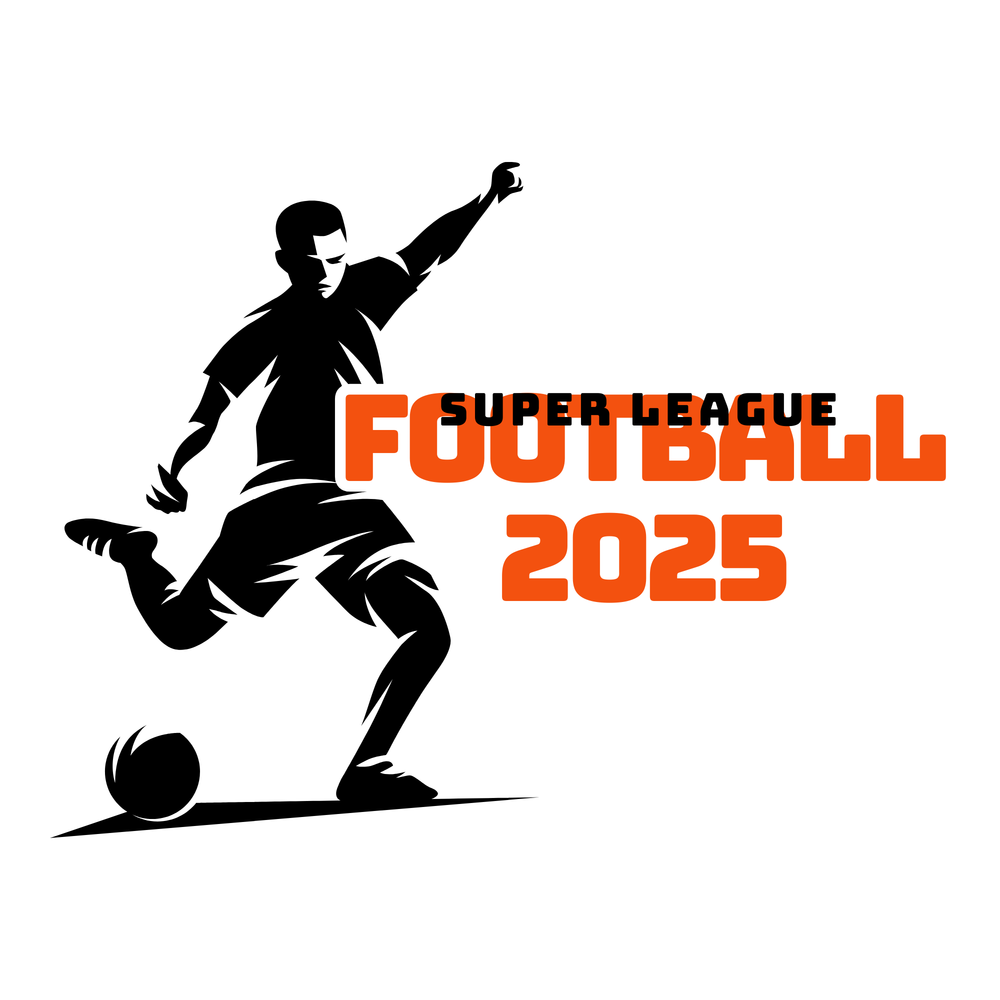

# UEFA Champions League - Upcoming Matches

A modern React application that displays upcoming UEFA Champions League football matches. The application features a beautiful home page with a background image and a dedicated matches page that shows at least 25 upcoming matches from the 2024 season.



## Features

- **Attractive Home Page**: Features a stunning background image, UEFA Champions League logo, and a call-to-action button.
- **Matches Display**: Shows at least 25 upcoming UEFA Champions League matches from the 2024 season.
- **Match Details**: Each match card displays:
  - Home and away teams
  - Match date and time (formatted for readability)
  - Competition stage/group information
  - Venue details
- **Responsive Design**: Fully responsive layout that works on mobile, tablet, and desktop devices.
- **API Integration**: Fetches real match data from the football-data.org API with fallback data if the API fails.
- **Modern UI**: Clean, modern interface with smooth animations and transitions.

## Technologies Used

- **React**: Frontend library for building the user interface
- **React Router**: For navigation between home and matches pages
- **CSS3**: Advanced styling with animations, transitions, and responsive design
- **football-data.org API**: For fetching real UEFA Champions League match data
- **Create React App**: Project was bootstrapped with Create React App

## Installation

1. Clone the repository:
   ```bash
   git clone <repository-url>
   cd upcoming-matches
   ```

2. Install dependencies:
   ```bash
   npm install
   ```

3. Start the development server:
   ```bash
   npm start
   ```
   The application will open in your browser at [http://localhost:3000](http://localhost:3000).

## API Configuration

The application uses the football-data.org API to fetch UEFA Champions League match data. By default, it works without an API key for basic access, but for production use, you should:

1. Register for a free API key at [football-data.org](https://www.football-data.org/client/register)


## Project Structure

```
├── public/
│   ├── bg-image.jpg        # Background image for home page
│   ├── Logo.png            # UEFA Champions League logo
│   └── ...                 # Other public assets
├── src/
│   ├── App.js              # Main application component with routing
│   ├── Home.js             # Home page component
│   ├── Match.js            # Matches page component
│   ├── App.css             # Global styles
│   ├── Home.css            # Home page styles
│   ├── Match.css           # Matches page styles
│   └── ...                 # Other React files
└── package.json            # Project dependencies and scripts
```

## Available Scripts

- **`npm start`**: Runs the app in development mode at [http://localhost:3000](http://localhost:3000)
- **`npm test`**: Launches the test runner
- **`npm run build`**: Builds the app for production to the `build` folder
- **`npm run eject`**: Ejects the Create React App configuration (one-way operation)

## Features in Detail

### Home Page

The home page features a stunning background image of a football stadium with the UEFA Champions League logo prominently displayed. It includes a call-to-action button that directs users to the matches page.

### Matches Page

The matches page displays a list of upcoming UEFA Champions League matches with the following features:

- **Smooth Animations**: Matches fade in when the page loads
- **Custom Scrollbar**: Styled scrollbar for better user experience
- **Match Cards**: Each card displays comprehensive match information
- **Hover Effects**: Cards feature a subtle gradient change and border highlight on hover
- **Responsive Layout**: Adapts to different screen sizes

### Fallback Data

The application includes a comprehensive fallback dataset of 25 UEFA Champions League matches from the 2024 season. This ensures that users always see match data, even if the API is unavailable or rate-limited.

## Deployment

To deploy this application to production:

1. Build the production-ready bundle:
   ```bash
   npm run build
   ```

2. Deploy the contents of the `build` folder to your hosting provider of choice (Netlify, Vercel, GitHub Pages, etc.).

## Contributing

Contributions are welcome! To contribute to this project:

1. Fork the repository
2. Create a feature branch (`git checkout -b feature/amazing-feature`)
3. Commit your changes (`git commit -m 'Add some amazing feature'`)
4. Push to the branch (`git push origin feature/amazing-feature`)
5. Open a Pull Request

## Acknowledgments

- [football-data.org](https://www.football-data.org/) for providing the API
- [UEFA Champions League](https://www.uefa.com/uefachampionsleague/) for the inspiration
- [Create React App](https://github.com/facebook/create-react-app) for the project setup

